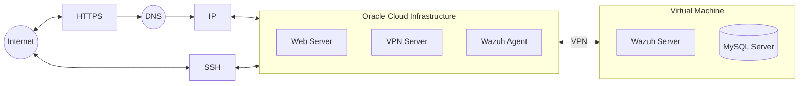

<div align="center">

# 👕 ImagineShirt: A Secure E-commerce Platform Implementation with Enterprise-Grade Security Measures 🛡️

[](https://laravel.com)
[](https://php.net)
[](https://www.mysql.com)
[](https://wazuh.com)

</div>

## 📝 Abstract

This repository presents ImagineShirt, an implementation of a secure e-commerce platform developed as part of the Master's in Computer Engineering - Mobile Computing program at the Polytechnic of Leiria. The system demonstrates the integration of enterprise-grade security measures with modern e-commerce functionality, emphasizing secure data handling and real-time threat monitoring capabilities.

## 1. 🎯 Introduction

### 1.1 Research Context

The proliferation of e-commerce platforms has led to increased security concerns regarding customer data protection and system integrity. This implementation addresses these challenges through a comprehensive security-first approach, combining traditional security measures with modern architectural patterns.

### 1.2 Objectives

The primary objectives of this research implementation include:
- Implementation of enterprise-level security measures in an e-commerce context
- Integration of real-time threat monitoring systems
- Development of a scalable, modular architecture
- Validation of security measures through comprehensive testing

## 2. 🏗️ System Architecture

### 2.1 💻 Technical Stack

The implementation utilizes the following technologies:
- Laravel 10.x as the primary framework
- PHP 8.x for server-side processing
- MySQL 8.x for data persistence
- Wazuh SIEM for security monitoring

### 2.2 🔄 Architectural Overview



## 3. 🔒 Security Implementation

### 3.1 🌐 Network Security Measures

The system implements multiple layers of network security:
- VPN-restricted administrative access
- Enterprise-grade firewall configuration
- Mandatory HTTPS protocol enforcement

### 3.2 🔐 Authentication Framework

```php
// config/security.php
return [
    'password_policy' => [
        'min_length' => 8,
        'require_special' => true,
        'require_numbers' => true,
        'require_mixed_case' => true,
    ],
    '2fa' => [
        'enabled' => true,
        'timeout' => 300,
        'cooldown' => 300,
    ],
];
```

### 3.3 👀 Monitoring Systems

The implementation incorporates comprehensive monitoring through:
- Real-time SIEM integration
- Custom security rule implementations
- Automated threat response mechanisms
- Systematic logging and notification systems

## 4. ⚙️ Implementation Methodology

### 4.1 🛠️ Development Environment Setup

```bash
# Repository initialization
git clone https://github.com/yourusername/imagineshirt.git

# Dependency installation
composer install
npm install

# Environment configuration
cp .env.example .env
php artisan key:generate

# Database initialization
php artisan migrate

# Development server deployment
php artisan serve
npm run build
```

### 4.2 🔧 VPN Configuration

```php
// config/vpn.php
return [
    'allowed_ranges' => [
        '10.0.0.0/8',
        '172.16.0.0/12',
        '192.168.0.0/16',
    ],
    'strict_mode' => true,
];
```

## 5. 👥 Project Made By

<table>
<tr>
<td align="center">
<a href="https://github.com/FranciscoMarques1">

<br />
<sub><b>Francisco Marques</b></sub>
</a>
</td>
<td align="center">
<a href="https://github.com/JoaoFranco03">

<br />
<sub><b>João Franco</b></sub>
</a>
</td>
<td align="center">
<a href="https://github.com/CallMeSusano">

<br />
<sub><b>Miguel Susano</b></sub>
</a>
</td>
</tr>
</table>

### 🎓 Academic Institution

**Polytechnic of Leiria**  
School of Technology and Management  
Department of Computer Engineering

---
